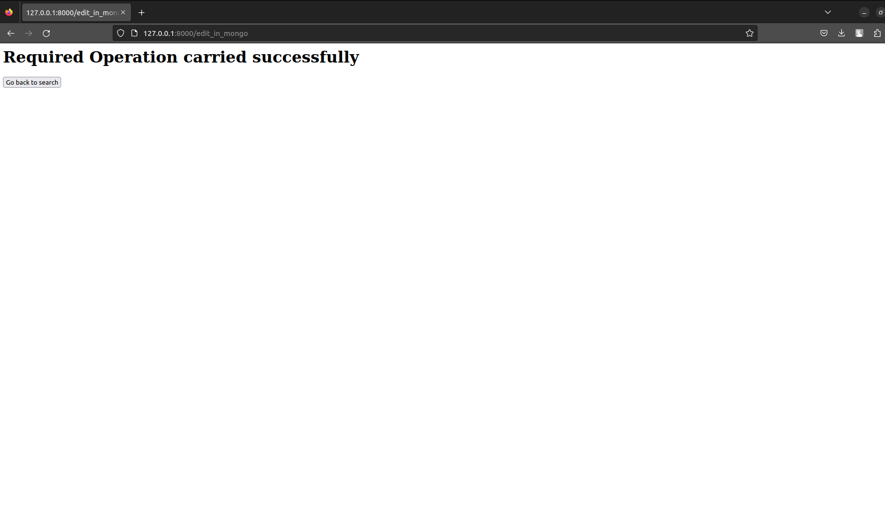

# A Tour into the WebSite MakeMyJobsEasy

- This repository contain all the files that were needed to built this website.
- **scrape.py** is not needed by this site, but it is the file which actually scraped the data from the site, and then put that data in MongoDB database.

# HomePage

This is the first page which appears on visiting this site.

Now we are searching into this search bar

# Search Results

This is what came when we searched for any particular company

This is how a job card looks , it has a button to delete and one button to edit the Job salary and skills

# Deletion

After deleting

# Editing

This is what appear when we click on Edit option on any job, here title is filled automatically and we can change skills and salary

After clicking on submit, we can also go to home by clicking on button

This button is made available everywhere to navigate to Home Page
